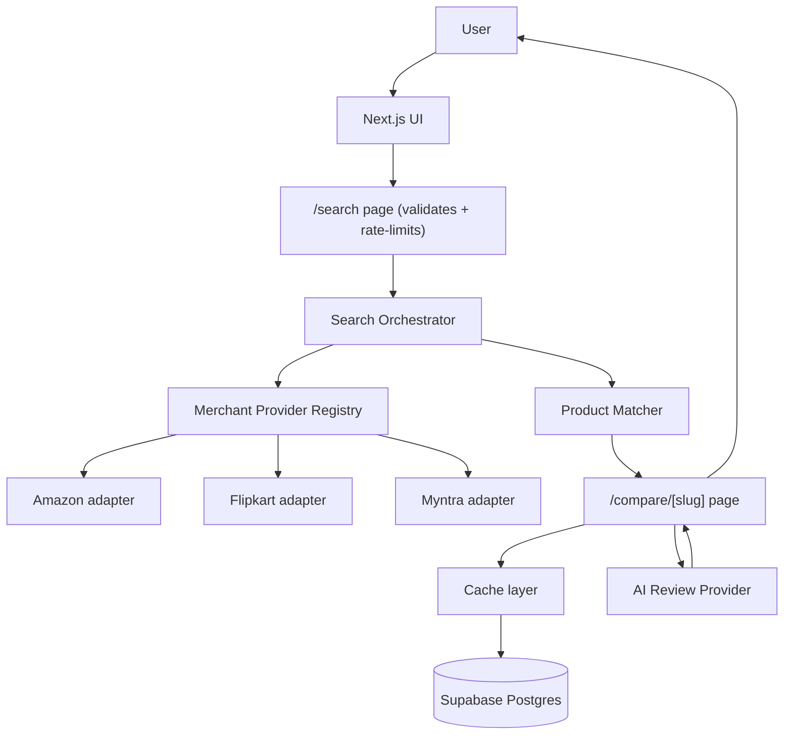

# Flex Architecture

Flex is a **modular monolith**: one Next.js app, with clean internal
boundaries, not microservices. That's the right call at this scale — it's
cheap, it's simple enough for one person to hold in their head, and each
module's interface is clean enough to split out later if Flex ever needs to.

## Request flow



1. The user searches on the homepage. `app/search/page.tsx` validates the
   query (`lib/validation/search.ts`) and checks a rate limit
   (`lib/security/rate-limit.ts`).
2. `lib/core/search/orchestrator.ts` fans the query out to every
   `MerchantProvider` in parallel, each with its own timeout — one slow or
   broken provider degrades gracefully instead of failing the whole search.
3. Raw listings go through `lib/core/matching/` (normalize → cluster → score)
   to decide which listings are the same real-world product. Low-confidence
   matches become a disambiguation screen instead of a silently wrong
   comparison.
4. A confident match redirects to `/compare/[slug]`, which checks the cache
   (`lib/db/cache.ts`) before recomputing, then renders the comparison table
   and AI review summary.

## Why a provider adapter per merchant

```ts
interface MerchantProvider {
  readonly id: MerchantId;
  searchProducts(query: string): Promise<MerchantListingCandidate[]>;
  buildRedirectUrl(productName: string): string;
}
```

Every merchant — mocked today, real later — implements this same interface.
`lib/core/search/orchestrator.ts` and everything above it only ever talks to
this interface, never to "Amazon" or "Flipkart" directly. Adding Ajio, Croma,
or a real Amazon integration later means writing one new class and adding it
to `lib/core/providers/registry.ts` — nothing else changes.

## What's real vs. mocked right now

| Piece | Status | Why |
|---|---|---|
| Amazon/Flipkart/Myntra listings | **Mocked** | None offers a free, individually-accessible API. Amazon's Product Advertising API requires an active affiliate account with qualifying sales; Flipkart's affiliate API requires manual approval; Myntra has none. Scraping would violate `robots.txt` (confirmed for Flipkart) and each platform's Terms of Use. |
| "View Deal" redirect links | **Real** | Built from each platform's own public search-URL pattern (`/s?k=`, `/search?q=`) and the matched product name — not scraped, just a constructed URL. |
| AI Review summary | **Mocked** | A deterministic, keyword-based summarizer (`lib/core/ai/mock-summarizer.ts`) behind the `AIReviewProvider` interface. No API key, no cost, and it structurally cannot fabricate anything beyond the snippets it's given. |
| Database | **Real** | A live Supabase Postgres project, accessed through Prisma. |

## Product matching

Deterministic rule-based extraction (`lib/core/matching/normalize.ts`), not
ML — brand, model, storage, colour, and size are pulled from the listing
title via per-category lookup tables and regexes. Listings are then grouped
(`lib/core/matching/match.ts`): two listings land in the same group only when
every attribute agrees after normalization. If the same brand+model appears
in more than one group (e.g. two genuinely different colourways), confidence
drops below `MATCH_CONFIDENCE_THRESHOLD` and the UI asks the user to pick,
instead of comparing unrelated listings.

This is intentionally simple. The interface
(`matchCandidates(candidates): MatchedVariantGroup[]`) is what the rest of
the app depends on — swapping the implementation for an embeddings-based
matcher later doesn't require touching any caller.

## Caching

`PriceSnapshot`, `RatingSnapshot`, and `AiReviewSummary` rows carry a
`fetchedAt` timestamp. A cache read is only considered "fresh" within a TTL
window (6h for price/rating, 24h for the AI summary); otherwise the
orchestrator recomputes and the cache layer appends new snapshot rows —
appends, not overwrites, which is what makes future price-history features
possible without a schema change. No Redis: Postgres reads/writes are cheap
enough at this scale. The cache is explicitly **not** a hard dependency — any
database error is treated as a cache miss (`lib/db/cache.ts`), so the app
still works end-to-end even with no database configured at all.

## AI cost control

`AIReviewProvider` is a one-method interface
(`summarize(snippets): Promise<ReviewSummary>`). The mock implementation is
free. If a real LLM-backed provider is added later, it plugs into the same
interface, and the orchestrator's existing cache (24h TTL, recompute only
when underlying review data changes) is what keeps that from becoming an
LLM call on every single search.
